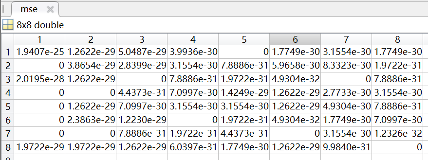
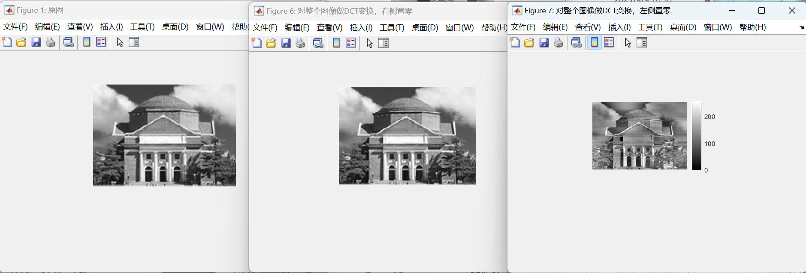
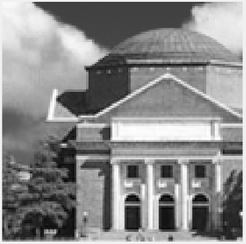

# MATLAB图像处理综合实验报告

*无13 孙文辉 2021012685*

## Part1 基础图像

### 1. images工具箱函数基本功能

### 2. image file I/O 基本处理

#### a 图像画圆

#####关键代码

```matlab
%画圆的两种方式
    %1. 调用rectangle函数
    rectangle('Position',[hall_color_size(2)/2-radius,hall_color_size(1)/2-radius,2*radius,2*radius],'Curvature',[1 1],'EdgeColor','r');
    axis equal;
    
    saveas(gcf,'hall_color_circle_out1.jpg');
    %2. 调用viscircles函数
    figure;
    image(hall.hall_color);
    viscircles([hall_color_size(2)/2,hall_color_size(1)/2],radius,'Color','r');
    axis equal;
    saveas(gcf,'hall_color_circle_out2.jpg');
```

##### 运行结果

`circle_ou1`


`circle_out2`


### b 国际象棋

##### 关键代码

```matlab
%逐像素操作
for i = 1:20:hall_color_h
for j = 1:20:hall_color_w
if mod((i-1)/20+(j-1)/20,2)==0
for m=1:20
for n=1:20
if(j-1+n<=hall_color_w&&i-1+m<=hall_color_h)
    hall_color(i+m-1,j+n-1,1)=0;
    hall_color(i+m-1,j+n-1,2)=0;
    hall_color(i+m-1,j+n-1,3)=0;
end
end
end
end
end
end
```

##### 运行结果


## Part2 图像压缩编码

### 1. 预处理在变换域进行的可行性

该步骤可以在变换域中进行。预处理对每个像素的灰度值减去128，相当于对图像灰度整体做平移，即只改变了图像的直流分量，图像的交流分量没有改变。因此是否做预处理，在变换域的表现为直流分量值发生变化，即左上角的数值变化。

##### 关键代码

```matlab
hall=load('hall.mat');
area=64;
figure('Name','原始灰度图像64×64');
imshow(hall.hall_gray(1:area,1:area));

figure('Name','预处理后的DCT变换');
hall_dct=dct2(double(hall.hall_gray(1:area,1:area))-ones(area)*128,[area,area]);
imshow(hall_dct);

figure('Name','未预处理的DCT变换');
hall_dct_2=dct2(double(hall.hall_gray(1:area,1:area)),[area,area]);
hall_dct_2(1,1)=hall_dct_2(1,1)-128*area;
imshow(hall_dct_2);
hall_idct=idct2(hall_dct_2);
%计算两个矩阵之间的均方误差
mse=(mean((hall_dct-hall_dct_2).^2))';
```

##### 运行结果

得到的均方误差如下图所示



均方误差均小于$1.9407\times10^{-25}$，因此该步骤可以在变换域进行。

### 2. 编程实现二维DCT

##### 关键代码

```matlab
%编程实现二维DCT
    % 这里为方便起见，直接对整个图像做了DCT变换
    [w,h]=size(hall.hall_gray);
    D1=D_calculate(w);%D_calculate是用于计算D矩阵的
    D2=D_calculate(h);
    hall_mandct2=D1*(double(hall.hall_gray)-ones(size(hall.hall_gray))*128)*D2';
    figure('Name','手写DCT变换');
    imshow(hall_mandct2);
```

这里直接对整个图像做了DCT变换，在`D_calculate.m`里写了一个任意方阵的DCT算子计算。

```matlab
function D=D_calculate(x)
    D=zeros(x,x);
    for j=1:x
        for i=1:x
            if i~=1
                D(i,j)=cos((2*j-1)*pi*(i-1)/(2*x));
            else
                D(i,j)=1/sqrt(2);
            end
        end
    end
    D=D*sqrt(2)/sqrt(x);
end

```

对于要处理的方阵**$P$**
$$
C=DPD^{T}
$$
对于要处理的一般二维矩阵（非方阵），假设矩阵$P：w\times h $

那么有
$$
C=D(w)P({D(h)})^{T}
$$

##### 运行结果


计算两个矩阵之间的均方误差，得到$min(mse)<1.3\times10^{-23}$，说明编程实现的二维DCT变换与MATLAB自带的库函数`dct2`相一致。

### 3. DCT系数矩阵部分置零

该题目有多种理解方式

1. 将整个图像的DCT系数矩阵右侧四列或左侧四列置零
2. 将每一块（`8*8`）DCT系数矩阵右侧四列或左侧四列置零

以及刚开始时我理解错了题目，将每一块（`8*8`）DCT算子的右侧四列或左侧四列置零，得到了不一样的结果

##### 关键代码

1. 将整个图像的DCT系数矩阵右侧四列或左侧四列置零

   ```matlab
   %直接使用dct2库函数,是对整个图像做dct变换
       test_hall_dct2=dct2(double(test_hall));
       %右侧置零
       test_hall_dct2(:,165:168)=0;
       test_hall_idct2=double(idct2(test_hall_dct2))+ones(size(hall.hall_gray))*128;
       figure('Name','对整个图像做DCT变换，右侧置零');
       imshow(uint8(test_hall_idct2));
       %左侧置零
       test_hall_dct2=dct2(double(test_hall));
       test_hall_dct2(:,1:4)=0;
       test_hall_idct2=double(idct2(test_hall_dct2))+ones(size(hall.hall_gray))*128;
       figure('Name','对整个图像做DCT变换，左侧置零');
       imshow(uint8(test_hall_idct2));
   
   ```

2. 将每一块（`8*8`）DCT系数矩阵右侧四列或左侧四列置零

   ```matlab
   %DCT计算完成的系数矩阵部分系数置0
       %Dp右侧四列全部置为0
       D=D_calculate(8);
       for i=1:8:168
           for j=1:8:120
               test_hall_dct2(j:j+7,i:i+7)=D*double(test_hall(j:j+7,i:i+7))*D';
               test_hall_dct2(:,i+4:i+7)=0;
           end
       end
       D=D_calculate(8);
       for i=1:8:168
           for j=1:8:120
               test_hall_idct2(j:j+7,i:i+7)=D'*double(test_hall_dct2(j:j+7,i:i+7))*D;
           end
       end
       test_hall_idct2=double(test_hall_idct2)+ones(size(hall.hall_gray))*128;
       figure('Name','Dp右侧四列全部置为0');
       imshow(uint8(test_hall_idct2));
       %Dp左侧四列全部置为0
       D=D_calculate(8);
       for i=1:8:168
           for j=1:8:120
               test_hall_dct2(j:j+7,i:i+7)=D*double(test_hall(j:j+7,i:i+7))*D';
               test_hall_dct2(:,i:i+3)=0;
           end
       end
       D=D_calculate(8);
       for i=1:8:168
           for j=1:8:120
               test_hall_idct2(j:j+7,i:i+7)=D'*double(test_hall_dct2(j:j+7,i:i+7))*D;
           end
       end
       test_hall_idct2=double(test_hall_idct2)+ones(size(hall.hall_gray))*128;
       figure('Name','Dp左侧四列全部置为0');
       imshow(uint8(test_hall_idct2));
   
   ```

3. 将每一块（`8*8`）DCT算子的右侧四列或左侧四列置零

   ```matlab
   %D算子部分系数置为0
       %D右侧四列全部置为0
       %猜测图像应该没有太大变化，因为右侧主要为高频分量
       %且在前例中右侧系数基本为0,图像几乎与不置零相同
       %这里使用的是编程实现的二维DCT
       D=D_calculate(8);
       D(:,5:8)=0;
       for i=1:8:168
           for j=1:8:120
               test_hall_dct2(j:j+7,i:i+7)=D*double(test_hall(j:j+7,i:i+7))*D';
           end
       end
       D=D_calculate(8);
       for i=1:8:168
           for j=1:8:120
               test_hall_idct2(j:j+7,i:i+7)=D'*double(test_hall_dct2(j:j+7,i:i+7))*D;
           end
       end
       test_hall_idct2=double(test_hall_idct2)+ones(size(hall.hall_gray))*128;
       figure('Name','D右侧四列全部置为0');
       imshow(uint8(test_hall_idct2));
       %D左侧四列全部置为0
       %图像会损失大量信息，左侧主要为低频分量
       D=D_calculate(8);
       D(:,1:4)=0;
       for i=1:8:168
           for j=1:8:120
               test_hall_dct2(j:j+7,i:i+7)=D*double(test_hall(j:j+7,i:i+7))*D';
           end
       end
       D=D_calculate(8);
       for i=1:8:168
           for j=1:8:120
               test_hall_idct2(j:j+7,i:i+7)=D'*double(test_hall_dct2(j:j+7,i:i+7))*D;
           end
       end
       test_hall_idct2=double(test_hall_idct2)+ones(size(hall.hall_gray))*128;
       figure('Name','D左侧四列全部置为0');
       imshow(uint8(test_hall_idct2));
   ```

##### 运行结果

1. 将整个图像的DCT系数矩阵右侧四列或左侧四列置零

   

   可以看出将右侧四列置零对图像质量几乎没有影响，因为右侧四列主要是图片的高频分量，大多数很小或者近乎为0；

   而将左侧四列置零后对图像有着较为明显的影响，图像的部分低频分量被置零，同时从图像中也可以看出图像中的过度不如原图平缓。

2. 将每一块（`8*8`）DCT系数矩阵右侧四列或左侧四列置零

   

   可以看出将每一块的DCT系数右侧四列置零后，图像也几乎没有变化，还是因为置零的大多数是高频分量，本身近乎为0；

   但将每一块DCT系数的左侧四列置零后，图像几乎消失了，这是因为对每一块DCT系数来说，其主要部分集中在低频，左侧四列置零直接使得DCT系数一半为0，低频信息几乎全部消失。

3. 将每一块（`8*8`）DCT算子的右侧四列或左侧四列置零

   

   可以看出图像的部分信息直接消失了，结合上述DCT系数的计算公式不难得出，DCT算子一半置零直接使得图像丢失了3/4的信息，这与低频或高频无关，因此表现出来就是图线呈网格状。

### 4. DCT系数矩阵变换

这里截取了`120*120`区域大小的图像进行变换；

原图像如下：



#### a 矩阵转置

##### 关键代码

```MATLAB
%系数转置
hall_dct_transpose=hall_dct';
figure('Name','系数矩阵转置');
hall_dct_transpose=double(idct2(hall_dct_transpose))+ones(size(area))*128;
imshow(uint8(hall_dct_transpose));
```

#####运行结果


可以看到图像旋转90°，因为转置并不影响高频与低频分量的位置，因此表现为图片旋转90°。

#### b 旋转90°

##### 关键代码

```matlab
%系数旋转90
hall_dct_rot90=rot90(hall_dct);
figure('Name','系数矩阵旋转90°');
hall_dct_rot90_=double(idct2(hall_dct_rot90))+ones(size(area))*128;
imshow(uint8(hall_dct_rot90_));
```

##### 运行结果


DCT系数旋转90°后，相当于将DCT分量中的高低频分量对调，其横纵特性也对调，后者导致了图像旋转90°，前者导致了很多低频分量变到高频，从而产生了很多横线。

####  c 旋转180°

##### 关键代码

```matlab
%系数旋转180
hall_dct_rot180=rot90(hall_dct_rot90);
figure('Name','系数矩阵旋转180°');
hall_dct_rot180=double(idct2(hall_dct_rot180))+ones(size(area))*128;
imshow(uint8(hall_dct_rot180));
```

##### 运行结果


DCT系数旋转180°后，相当于将DCT分量中的高低频分量对调，其横纵特性也对调，图片旋转回原来的位置，但出现了很多以某个点为中心向四周扩散的条纹。

### 5. 差分编码系统

##### 关键代码

```matlab
%差分编码目的是更多地保留低频分量中的差异信息，因此直觉上来看就是一个高通滤波器
%其序列的递推式为与y(n)=x(n-1)-x(n)
%z变换后结果为H(z)=z^(-1)-1
close all;
clear;
clc;
b=[1 -1];
a=[1];

freqz(b,a);
```

##### 运行结果


根据上图可知，差分编码系统是一个高通滤波器，DC系数先进行差分编码再进行熵编码，说明DC系数的高频分量更多。

### 6. Category及其计算

Category其实就是DC预测误差用二进制表示所需要的最少位数。在解码中体现为：利用`huffman`码解出Category，那么Category对应的DC预测误差的二进制表示就是往后的Category位。
$$
Category=floor(\log2(abs(DC)))+1
$$
**注意：这里$floor(x)+1\neq ceil(x)$，两者值并不总是相同！（对任意正整数就不成立）**

### 7. zig-zag扫描

zig-zag扫描方法：

1. 循环扫描，未到矩阵边界时行数-1，列数+1,到矩阵边缘时，非边缘的行/列数+1；

2. 该过程类似于多项式乘法，自然联想到利用类似卷积的方法实现，不过需要根据奇偶性改变数组顺序；

3. 利用hash的方法，将一个二维矩阵直接映射为一个一维矩阵，在使用时直接利用hash索引即可

4. 已知matlab可以以矩阵为参数，使一个矩阵以参数矩阵的方式进行重新排列。该方法没什么计算量，效率应该最高，因此这里采用了这种方法，预设好参数矩阵，利用参数矩阵将矩阵重新排列，再利用matlab的reshape函数，将二维矩阵转换为一维向量

##### 关键代码

```matlab
%代码在zig_zag.m中
function y = zig_zag(x)

    z = [ 1     11    34    28    29    44    24    47; 
          9     4     27    35    22    51    32    40; 
          2     5     20    42    15    58    39    48; 
          3     12    13    49    8     59    46    55; 
          10    19    6     57    16    52    53    62; 
          17    26    7     50    23    45    60    63; 
          25    33    14    43    30    38    61    56; 
          18    41    21    36    37    31    54    64];
    y = reshape(x(z),[64,1]);
end
```

类似地，也有逆zig_zag，就是将上述过程反过来

```matlab
%i-zig_zag
function y=izig_zag(x)
    y=reshape(x,[8,8]);
    z=[1  2  6  7  15 16 28 29;
       3  5  8  14 17 27 30 43;
       4  9  13 18 26 31 42 44;
       10 12 19 25 32 41 45 54;
       11 20 24 33 40 46 53 55;
       21 23 34 39 47 52 56 61;
       22 35 38 48 51 57 60 62;
       36 37 49 50 58 59 63 64;];
    y=y(z);
end
```

##### 运行结果

这里用`8*8`的二维幻方矩阵进行测试

```
 test=magic(8);
 out_1=zig_zag(test);
 out_2=izig_zag(out_1);
```


此处为了后续方便处理，直接将`out_1` `reshape`为一个列向量，不方便写在实验报告中，但经过测试没有问题。

### 8. 测试图像分块、DCT、量化、zig-zag扫描

前面的集合体。

##### 关键代码

```matlab
close all;
clear;
clc;
%分块、DCT、量化
hall=load('hall.mat');
parameter=load('JpegCoeff.mat');
%hall.hall_gray=randi([0,256],120,168);
%randi_test=hall.hall_gray;
%imshow(uint8(randi_test));
DC_offset=ones(8)*128;
hall_dct2=zeros(size(hall.hall_gray));
hall_quan=zeros(size(hall.hall_gray));
hall_quan_zigzag=zeros(64,(120*168)/64);
QTAB=parameter.QTAB;
for i = 1:8:168
    for j = 1:8:120
        hall_dct2(j:j+7,i:i+7)=dct2(double(hall.hall_gray(j:j+7,i:i+7))-DC_offset);
        hall_quan(j:j+7,i:i+7)=round(hall_dct2(j:j+7,i:i+7)./QTAB);
        hall_quan_zigzag(:,21*round((j-1)/8)+round((i-1)/8)+1)=zig_zag(hall_quan(j:j+7,i:i+7));
    end
end
%结果保存在'exp2_4_8_out.mat'
save('exp2_4_8_out.mat','hall_quan_zigzag');
%save('randi_test.mat','randi_test');

```

##### 运行结果

运行结果保存在'exp2_4_8_out.mat'

### 9. JPEG编码

##### 关键代码

**DC系数差分编码**

Category其实就是DC预测误差用二进制表示所需要的最少位数，因此在编码时应注意，当DC预测误差为0时，0对应的Category为0，这表示0位来表示0，因此不需要再后面加上0的二进制编码，实际上由于该二进制编码的位长限制，0的二进制编码与-1是相同的，这在后面的解码过程中会带来问题，所以没有必要也不能加上0的二进制编码。

```matlab
%DC系数差分编码
DC_data=hall_quan_zigzag(1,:);
DC_diffcode=DC_data;
DC_code=[];

for i =2:max(size(DC_data))
    DC_diffcode(i)=DC_data(i-1)-DC_data(i);
end
i=1;
for i=1:max(size(DC_data))
    %确定Category及其huffman编码，并将后者添加到DC_code中
    if DC_diffcode(i)==0
        DC_code=[DC_code,[0,0]];
    else
        n=floor(log2(abs(DC_diffcode(i))))+1;
        DC_code=[DC_code,DCTAB(n+1,2:(DCTAB(n+1,1)+1))];
    end
    %确定预测误差的huffman编码并添加到DC_code中
    if DC_diffcode(i)~=0
        DC_code=[DC_code,complement(DC_diffcode(i))];
    end
end
```

**AC系数编码**

```matlab
%AC系数编码
AC_code=[];
uint8 run;
uint8 count;
run=0;
i=1;
for i=1:max(size(DC_data))
    count=nnz(hall_quan_zigzag(2:64,i));
    for j=2:64
        if count==0
            AC_code=[AC_code,[1,0,1,0]];
            break;
        else
            if hall_quan_zigzag(j,i)==0
                run=run+1;
                if run==16
                    AC_code=[AC_code,[1,1,1,1,1,1,1,1,0,0,1]];
                    run=0;
                end
            else 
                n=floor(log2(abs(hall_quan_zigzag(j,i))))+1;
                AC_code=[AC_code,ACTAB(run*10+n,4:(ACTAB(run*10+n,3)+3))];
                AC_code=[AC_code,complement(hall_quan_zigzag(j,i))];
                count=count-1;
                run=0;
            end
        end
    end
end
w=complement(w);
h=complement(h);
save('jpegcodes.mat','DC_code','AC_code','w','h');

```

**二进制编码实现**

```matlab
function y=complement(x)
    if x~=0
        length=floor(log2(abs(x)))+1;
    else 
        length=1;
    end
  if (x>=0)
      y=dec2bin(x,12);
  else
      y=dec2bin(x-1,12);
  end
  y=y-'0';
  y=[y((13-length):12)];
  
end
```

也是直接调用dec2bin函数，实际上dec2bin函数只有一个输入参数时会自动变为表示该字所需要的最少位数，但是dec2bin使用的是补码，并非1-补码，因此还得手动改一下（PS:或许你会奇怪为什么该函数的名字是complement（补码），唔我在一开始写的时候没有看到1-补码的“1”，从而浪费了大量的debug时间）。

##### 运行结果

运行结果保存在'jpegcodes.mat'中。

### 10. 压缩比计算

非常简单，直接均转换为二进制即可

```matlab
168*120*8/(length(AC_code)+length(DC_code)+length(h)+length(w))
```

但是这里我想要使用一下函数作用于矩阵的每一个元素，避免使用循环，就采用了如下的方法

##### 关键代码

```matlab
global origin2bin;

origin2bin=[];
load ('hall.mat');
origin=reshape(hall_gray,1,[]);
arrayfun(@comple,origin)
origin_size=length(origin2bin);

load('jpegcodes.mat');
compress=length(AC_code)+length(DC_code)+length(h)+length(w);
compression_ratio=double(origin_size/compress);
disp(['compression_ratio=',compression_ratio]);

function comple(x)
    global origin2bin;
          y=dec2bin(x,8);    
      y=y-'0';
      origin2bin=[origin2bin,y];
end
```

##### 运行结果


压缩比为$6.4209$

### 11.JPEG解码

##### 关键代码

**DC系数解码**

DC系数解码就是按顺序得到`huffman`码，从而得到Category，再取得后面的Category位，得到差分系数的二进制表示，转化为十进制后即可得到差分系数，再逐项相减即可得到DC系数。

```matlab
%DC系数解码
%huffman解码得到category，根据category解出magnitude
encode='';
diffcode =[];
i=1;
while i<length(DC_code)
    encode=[encode num2str(DC_code(i))];
    match=find(strcmp(huffman_table(:,2),encode));
    if ~isempty(match)
        category=str2num(huffman_table{match,1});  
        diffcode=[diffcode,icomplement(num2str(DC_code(i+1:i+category)))];
        encode='';
        i=i+category;
    end
    i=i+1;
end
%DC系数
DC_quant=[diffcode(1)];
for i=1:length(diffcode)-1
    DC_quant=[DC_quant,(DC_quant(i)-diffcode(i+1))];
end

```

**AC系数解码**

个人认为大作业中最难也是最重要的一环，我在这里花费了大量时间，AC解码的成功与否直接关系到后面的雪花以及信息隐藏能否成功。

```matlab
%AC系数解码
%huffman解码得到category，根据category解出Amp
EOB=[1,0,1,0];
ZRL=[1,1,1,1,1,1,1,1,0,0,1];
RunSize=[0,0];
encode=[];%待解码，需要从AC_code中取出
accode=[];%解出的ac码
ac_huff_code=[];%ACTAB中取出的huffman编码
i=1;
count=0;
while i<=length(AC_code)
    encode=[encode AC_code(i)];
    if length(encode)==4
            if encode==EOB
                %RunSize=[0,0];
                accode=[accode,zeros(1,63-mod(length(accode),63))];%63-(length(accode)-63*count))
                %结束并更新
                count=count+1;
                i=i+1;
                encode=[];
                continue;
            end
    end
    if length(encode)==11
            if encode==ZRL
                %RunSize=[16,0];
                accode=[accode,zeros(1,16)];
                %结束并更新
                i=i+1;
                encode=[];
                continue;  
            end
    end
    %先找到对应的码长，再逐个比较，从而减少比较次数
    [temp,~,~]=find(ACTAB(:,3)==length(encode));
    for j=1:length(temp)
        ac_huff_code=ACTAB(temp(j),4:length(encode)+3);
        if isequal(ac_huff_code,encode)
            RunSize=[ACTAB(temp(j),1),ACTAB(temp(j),2)];
            accode=[accode,zeros(1,RunSize(1))];
            accode=[accode,icomplement(num2str(AC_code(i+1:i+RunSize(2))))];
            %结束并更新
            encode=[];
            i=i+RunSize(2);
            continue;
        end
    end
    i=i+1;
end
h=icomplement(num2str(h));
w=icomplement(num2str(w));
accode=reshape(accode,[63,h*w/64]);
hall_quant_izigzag(1,:)=DC_quant;
hall_quant_izigzag(2:64,:)=accode;
```

**注意：EOB并不总是存在的**，即每一个块并不一定以0结束，虽然对于绝大多数“正常”的图像来说是以0结束的。因此在每一行的补0时不能简单地采用`63-(length(accode)-63*count))`（count为当前列数）来表示。这里我是将所有的accode都解码为一行，再转换为`63*315`的矩阵，事实上，只要在解码时直接转换为矩阵就可以很好的解决该问题。这个问题是在我后来编解码雪花图像时出现的，只要ac解码失败，accode的长度必然不正确，reshape矩阵参数对不上就会报错。

**`PSNR`计算**

```matlab
mse=sum(sum((double(hall)-double(hall_gray)).^2))/numel(hall);
PSNR=10*log10(255^2/mse);
disp(['PSNR=',num2str(PSNR)]);
```

##### 运行结果

**原图**


**编解码后的图像**


**PSNR**


主观上来看几乎分辨不出差别，如果仔细放大看会有一些噪点（大礼堂左上角）。

### 12. 半量化重新编解码

重复上述过程

**压缩比**


**PSNR**


**编解码后的图像**


主观上几乎没有区别，从压缩比和`PSNR`来看提升了精确度，但是牺牲了空间。


### 13. 雪花图像编解码

##### 运行结果

**原图**


**编解码后图像**


从客观数据来看，对于雪花图像，压缩比与`PSNR`相较于一般的图片都有所降低，这是因为雪花图片基本上可以视为随机的，其高频分量较多，因此在量化过程中会损失较多的高频分量，体现为`PSNR`降低。当然从主观上来看都是雪花，看不太出来区别。

## Part3 信息隐藏

### 1. 空域信息隐藏与提取

这里信息编码包括：信息的二进制矩阵的长度与宽度以及信息的二进制码流。在保存长度和宽度上采用了类似于DC直流系数的形式，即`Category+二进制表示`，其中`Category`用`huffman`编码表示。

##### 关键代码

**信息隐藏**

```matlab
%-----------------------------------------信息隐藏------------------------------------------
%信息编码:info_code内容包括:Category,长,Category,宽,信息的二进制流
info='Message In A Bottle';
disp(["info:",info]);
%将信息编码为二维的二进制矩阵，每一行都是一个字符
info_bin=logical(dec2bin(double(info),8)-'0');
%获取上述二进制矩阵的长和宽
info_size=size(info_bin);
%类似于DC系数的形式存储矩阵的长度与宽度信息,显然这两个数都是正整数
info_code=[];
i=1;
for i=1:2
    n=floor(log2(abs(info_size(i))))+1;
    info_code=[info_code,DCTAB(n+1,2:(DCTAB(n+1,1)+1))];  
    info_code=[info_code,complement(info_size(i))];
end
info_bin=reshape(info_bin,[1,info_size(1)*info_size(2)]);
info_code=[info_code,info_bin];
hall_bin=logical(dec2bin(double(hall_gray),8)-'0');
hall_bin(1:length(info_code),8)=info_code';
hall_ibin=reshape(bin2dec(num2str(hall_bin)),[hall_h,hall_w]);
figure("Name","信息隐藏后的图片");
imshow(uint8(hall_ibin));
```

操作后发现其实该解码方式可以进行化简：

1. 信息使用`ASCII`编码，每一位都是用`8bit`表示的，因此这里的二进制矩阵的列数一定是8，因此可以直接舍弃8的编码；
2. 可以事先约定好利用前`8bit`来存储信息二进制矩阵的长度信息，从而大大节省编码难度。

然而这种编码方式也有其独特优点，不止可以传递文字信息，还可以很方便地直接隐藏图片。

**信息解码**

```matlab
%-----------------------------------------信息解码-----------------------------------------
hall_bin_find=reshape(hall_ibin,[hall_h*hall_w,1]);
hall_bin_find=logical(dec2bin(double(hall_bin_find),8)-'0');
info_code_find=hall_bin_find(:,8)';

encode='';
info_size_decode =[];
i=1;
count=0;
while i<length(info_code_find)&&count<2
    encode=[encode num2str(info_code_find(i))];
    match=find(strcmp(huffman_table(:,2),encode));
    if ~isempty(match)
        category=str2num(huffman_table{match,1});  
        info_size_decode=[info_size_decode,icomplement(num2str(info_code_find(i+1:i+category)))];
        encode='';
        i=i+category;
        count=count+1;
    end
    i=i+1;
end
info_ibin=info_code_find(i:i+info_size_decode(1)*info_size_decode(2)-1);
info_ibin=reshape(info_ibin,[info_size_decode(1),info_size_decode(2)]);
info_debin=char(bin2dec(num2str(info_ibin)))';
disp(["info_debin:",info_debin]);
```

##### 运行结果


待隐藏信息是:Messag In A Bottle；

解码后信息是:Message In A Bottle；

在经过JPEG编解码后信息消失。

这里信息并不是乱码，查询工作区变量信息可以得到解释，这是因为解码时`huffman`编码中恰巧遇到了`00`，对应的Category为0，因此行数直接不存在，所以没有解码信息。不过这也说明该信息隐藏方式具有抗JPEG编码的能力。

从主观与客观来看，隐藏信息后的图像与原图像几乎无区别。

### 2.三种变换域信息隐藏与提取

#### a 信息位逐一替换掉量化后DCT系数最低位

##### 关键代码

```matlab
%-----------------------------------------信息隐藏------------------------------------------
%信息编码:info_code内容包括:Category,长,Category,宽,信息的二进制流
info='Message In A Bottle';
fprintf('%s\n',info);
%将信息编码为二维的二进制矩阵，每一行都是一个字符
info_bin=logical(dec2bin(double(info),8)-'0');
%获取上述二进制矩阵的长和宽
info_size=size(info_bin);
%类似于DC系数的形式存储矩阵的长度与宽度信息,显然这两个数都是正整数
info_code=[];
i=1;
for i=1:2
    n=floor(log2(abs(info_size(i))))+1;
    info_code=[info_code,DCTAB(n+1,2:(DCTAB(n+1,1)+1))];  
    info_code=[info_code,complement(info_size(i))];
end
info_bin=reshape(info_bin,[1,info_size(1)*info_size(2)]);
info_code=[info_code,info_bin];
hall_bin=dec2bin(hall_quan_zigzag,8)-'0';
hall_bin(1:length(info_code),8)=info_code';% bin2dec居然不支持补码!!!!!
hall_ibin=reshape(bin2dec(num2str(hall_bin)),[64,315]);%懒了，不管效率了，直接打个补丁
%屎山代码开端-打补丁
for i=1:64
    for j=1:315
        if(hall_ibin(i,j)>127)
            hall_ibin(i,j)=hall_ibin(i,j)-256;
        end
    end
end
hall_quan_zigzag=hall_ibin;
%-----------------------------------------抗JPEG解码-----------------------------------------
%这里采用huffman编码来确定info_bin的长和宽，因此可能会出现1.乱码2.空白
hall_quant_izigzag_size=size(hall_quant_izigzag);
hall_quant_izigzag_h=hall_quant_izigzag_size(1);
hall_quant_izigzag_w=hall_quant_izigzag_size(2);
hall_bin_find=reshape(hall_quant_izigzag,[hall_h*hall_w,1]);
hall_bin_find=logical(dec2bin(double(hall_bin_find),8)-'0');
info_code_find=hall_bin_find(:,8)';
```

**注：matlab的`bin2dec`函数不支持补码，因此-1在经过`dec2binbin2dec`后就变成了255**

##### 运行结果

这里为了控制变量，保持信息的一致性，并没有将所有的DCT系数后都存储信息。


该信息隐藏方式具有抗JPEG编码能力。

观察图片可以发现，隐藏信息后图片上方会出现类似马赛克的块，图片质量有一定的损失，且`PSNR`与压缩比均有下降。

但后面加大了内容量，若将所有的DCT系数的最后一位都存储信息，PSNR会出现严重下降。这主要是因为在存储时考虑了所有DCT系数，这使得大量的低频分量也被改变，因此导致图像质量严重下降。

#### b 信息位替换掉若干量化后DCT系数最低位

由上，可以只考虑将信息存在最高频分量上。

##### 关键代码

几乎同上。

##### 运行结果


主观上看图片质量几乎无损失，客观数据相较于上一题来看更接近与原图（几乎一致）。

#### c [1,-1]编码，追加在DCT-zigzag非零系数后

##### 关键代码

```matlab
%-----------------------------------------信息编码------------------------------------------
%信息编码:info_code内容包括:Category,长,Category,宽,信息的二进制流
info='Message In A Bottle';
disp(["info:",info]);
%将信息编码为二维的二进制矩阵，每一行都是一个字符
info_bin=logical(dec2bin(double(info),8)-'0');
%获取上述二进制矩阵的长和宽
info_size=size(info_bin);
%类似于DC系数的形式存储矩阵的长度与宽度信息,显然这两个数都是正整数
info_code=[];
i=1;
for i=1:2
    n=floor(log2(abs(info_size(i))))+1;
    info_code=[info_code,DCTAB(n+1,2:(DCTAB(n+1,1)+1))];  
    info_code=[info_code,complement(info_size(i))];
end
info_bin=reshape(info_bin,[1,info_size(1)*info_size(2)]);
info_code=[info_code,info_bin];
for i=1:length(info_code)
    if info_code(i)==0
        info_code(i)=-1;
    end
end
%-------------------------------------------信息隐藏-------------------------------------------
for i=1:length(info_code)
    for j=64:-1:1
        if hall_quan_zigzag(64,i)~=0
            hall_quan_zigzag(64,i)=info_code(i);
            break;
        else if hall_quan_zigzag(j,i)~=0
                hall_quan_zigzag(j+1,i)=info_code(i);
                break;
            end
        end
    end
end
%结果保存在'exp2_4_8_out.mat'
save('exp2_4_8_out.mat','hall_quan_zigzag');
%save('randi_test.mat','randi_test');
%-----------------------------------------抗JPEG解码-----------------------------------------
%这里采用huffman编码来确定info_bin的长和宽，因此可能会出现1.乱码2.空白
info_code_find=[];
i=1;
for i=max(size(hall_quant_izigzag)):-1:1
    for j=64:-1:1
        if hall_quant_izigzag(j,i)~=0
            info_code_find(i)=hall_quant_izigzag(j,i);   
            break;
        end
    end
end
for i=1:length(info_code_find)
    if info_code_find(i)==-1
        info_code_find(i)=0;
    end
end

```

##### 运行结果


主观上来看相较于上一问图片变得更糊了，但没有明显差距。

##Part4 人脸识别

### 1.

##### a. 

不需要，因为这里检测的是人脸颜色的概率，并不是人脸像素的大小。

##### b.

呈8倍关系（$2^3$)

### 2. 人脸识别算法实现

##### 关键代码

**特征训练**

****

```matlab
%特征训练
L=5;
v=zeros(2^(3*L),1);
for i=1:33%33为训练集的照片张数
    v=v+feature_extr(imread(['Faces/' num2str(i) '.bmp']),L);
end
v=v/33;
plot(v);
title('特征-概率密度');
xlabel('index');
ylabel('概率');
set(gca,'YLim',[0 0.007]);
save feature_extraction.mat v
%人脸检测

```

**人脸检测**

```matlab
load('feature_extraction.mat');
L=5;
block_noise=10;%噪声阈值，用来抛弃过小的噪声项
block_threshold_down=500;%脸部大小下限，用来排除手等因素干扰，正常人的脸都比手大
block_threshold_up=40000;%脸部大小上限
ratio=2;%脸部的长宽比上限，用来排除胳膊大腿等细长物体干扰
test_img=imread('test5.jpg');
%imshow(test_img);
[row,column,color]=size(test_img);
%将图片按4*4进行分割
width=4;
row_div=floor(row/width)+1;
column_div=floor(column/width)+1;
judge=zeros(row_div,column_div);
%阈值
threshold=0.08;

%块内判断
for i=1:row_div
    for j=1:column_div
        %取出block
        test_block=test_img(width*(i-1)+1:min(row,width*i),4*(j-1)+1:min(column,width*j),:);
        u=feature_extr(test_block,L);
        %判断
        angle=sqrt(u')*sqrt(v);
        if angle>threshold
            judge(i,j)=1;
        end
    end
end
%画框
 imshow(test_img);
[judge_bound,~]=bwboundaries(judge);
block_num=size(judge_bound,1);

block_flag=zeros(row,column);
for i=1:block_num
     [length_block, ~]=size(judge_bound{i,1});
    if length_block<block_noise
        continue;
    end
    x_min = min(judge_bound{i,1}(:,1))*width;
    x_max = max(judge_bound{i,1}(:,1))*width;
    y_min = min(judge_bound{i,1}(:,2))*width;
    y_max = max(judge_bound{i,1}(:,2))*width;
    w=x_max-x_min;
    h=y_max-y_min;
    	if(w*h>block_threshold_down&&w*h<block_threshold_up&&block_flag(x_min,y_min)==0&&(max([h,w])/min([h,w])<ratio))
        rectangle('Position',[y_min,x_min,h,w],'EdgeColor','y');
        block_flag(x_min+1:x_max-1,y_min+1:y_max-1)=1;
        
    end
end
%imshow(test_img);
hold off;
```

这里定义了几个参数：

1. block_noise噪声阈值：用来抛弃较小的噪声项；
2. block_threshold_down脸部大小下限，用来排除手等因素干扰，正常人的脸都比手大
3. block_threshold_up脸部大小上限
4. ratio脸部的长宽比上限，用来排除胳膊大腿等细长物体干扰

可以尽可能的排除手、腿等无关因素的干扰。

##### 运行结果

**特征提取**


**人脸识别**

不断调节参数后结果如下：


### 3. 图像预处理后人脸识别

#### a 顺时针旋转90°

#### b 保持高度不变，宽度拉伸为原来的2倍

#### c 适当改变颜色